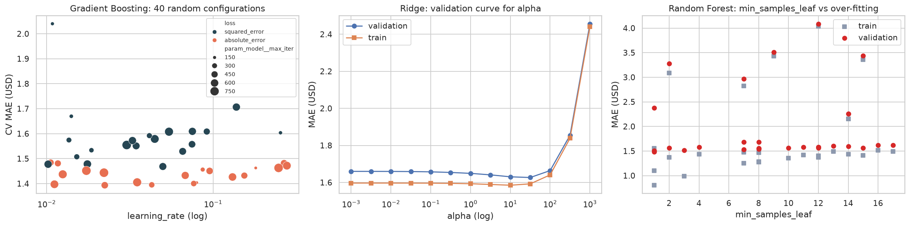
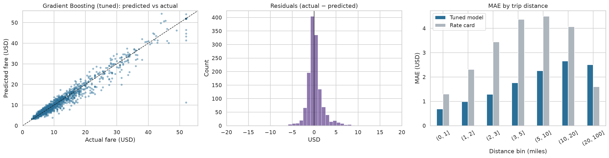
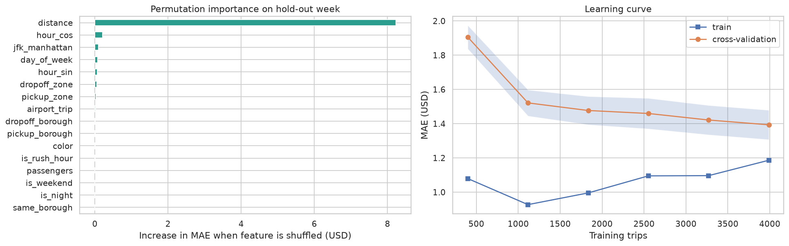
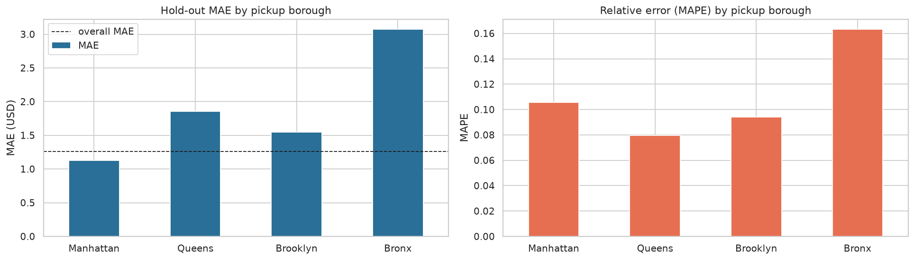
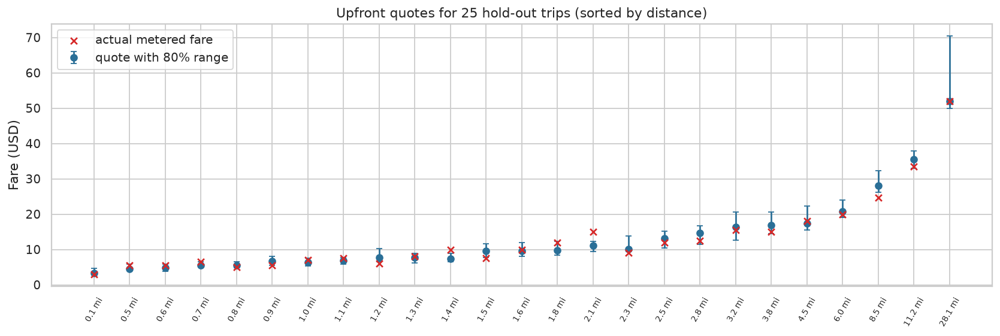

# Upfront Fare Estimation for NYC Taxis
### Real-World AI-Driven Analytics Solution Using Python — Deliverable 2: Model Optimization, Real-World Impact, and Ethical Evaluation

**Dataset:** NYC Taxi & Limousine Commission (TLC) trip records, yellow and green taxis, March 2019 (6,433 trips; 6,348 after cleaning)
**Task:** Regression. The model predicts the metered fare (USD) from information that is known at booking time.
**Code:** [`NYC_Taxi_Fare_Deliverable2.ipynb`](NYC_Taxi_Fare_Deliverable2.ipynb) (pandas, NumPy, Matplotlib, Seaborn, scikit-learn; runs in Google Colab)

> **Problem recap (Deliverable 1).** App-based ride services quote a price before the trip starts. A NYC taxi fare is only known when the meter stops. Taxi fleets, e-hail apps and the TLC want an accurate **upfront fare estimate** so that riders can budget and compare transport options. In Deliverable 1 we cleaned the data (98.7% of rows kept) and built features that are known at booking time: distance, hour and day, boroughs, frequent zones, airport and JFK flat-fare flags, taxi colour and party size. We deliberately left out the outcome fields tip, tolls, total, duration and dropoff time to prevent leakage. We also set baselines. The last week of March (25–31 March, 1,363 trips) is held out as a time-based test set. All tuning uses 5-fold cross-validation (CV) on the first 3½ weeks (4,985 trips).

---

## 1. Hyperparameter Tuning

We tuned three model families, each wrapped in a scikit-learn `Pipeline`. The preprocessing is the same across models: numeric features are standardised for Ridge only, and categorical features are one-hot encoded with zones seen fewer than 20 times grouped together. The optimisation metric is **mean absolute error (MAE, in dollars)**. MAE is the average amount by which a quote misses the fare, and a few extreme trips affect it less than they affect RMSE.

| Model | Method | Search space | Configs | Default CV MAE | **Tuned CV MAE** | Gain |
|---|---|---|---|---|---|---|
| Ridge regression | `GridSearchCV` | `alpha` 10⁻³–10³ (13 values) | 13 | $1.649 | **$1.627** | 1.4% |
| Random Forest | `RandomizedSearchCV` | trees, depth, min leaf, max features | 30 | $1.511 | **$1.485** | 1.7% |
| Hist. Gradient Boosting | `RandomizedSearchCV` | learning rate, iterations, leaves, min leaf, L2, loss | 40 | $1.506 | **$1.394** | 7.4% |

**Best settings.** Ridge: `alpha = 31.6`. Random Forest: 559 trees, `max_depth = 14`, `max_features = 0.7`, `min_samples_leaf = 1`. Gradient Boosting: `learning_rate = 0.022`, `max_iter = 492`, `max_leaf_nodes = 22`, `min_samples_leaf = 19`, `l2_regularization = 0.41`, **`loss = absolute_error`**.

**What we learned.**
* **The loss function mattered more than any other setting.** Every one of the best gradient-boosting configurations used the absolute-error loss (orange points in the left panel). Taxi fares contain a few very large outliers, such as flat-fare and mis-keyed trips. Squared-error loss chases these outliers, while absolute-error loss matches the metric we care about.
* **A small learning rate with many trees** (about 0.02 × 500) generalised best. That is the usual trade-off between shrinkage and number of iterations.
* **Ridge barely changed.** The validation curve is flat up to α ≈ 30 and then rises sharply. The linear model is limited by bias, not variance, so regularisation cannot close the gap to the tree models.
* **Random Forest over-fits.** Its best model has a training MAE of $0.81 against a validation MAE of $1.49. The right panel shows that shallow trees or a very low `max_features` value hurt much more than over-fitting does, which is why the search still preferred deep trees.
* **Cost.** Randomized search took 2–4 minutes on 5k rows. For the full TLC month (millions of rows), the same code should be run on a sample of about 200k rows, optionally loading the data with Dask. A successive-halving search (`HalvingRandomSearchCV`) would lower the cost further.

---

## 2. Final Model Evaluation

Each tuned model was refit on all training weeks and scored **once** on the unseen hold-out week. We compared the models with two reference points: a mean-fare dummy and the **official 2019 TLC rate card** ($2.50 + $2.50 per mile, plus the $52 JFK↔Manhattan flat fare). The rate card is what a rider could work out without any machine learning.

| Model (hold-out week, n = 1,363) | MAE | RMSE | R² | MAPE | Quote within $2 | Within 10% |
|---|---|---|---|---|---|---|
| **Gradient Boosting (tuned)** | **$1.26** | **$2.28** | **0.951** | **10.3%** | **83.3%** | **57.5%** |
| Random Forest (tuned) | $1.37 | $2.33 | 0.949 | 11.5% | 80.1% | 53.9% |
| Ridge (tuned) | $1.55 | $2.64 | 0.935 | 14.1% | 78.4% | 48.3% |
| TLC rate card (rule) | $2.76 | $3.91 | 0.858 | 22.3% | 50.4% | 16.7% |
| Mean fare (dummy) | $7.17 | $10.36 | 0.000 | 72.5% | 14.1% | 10.2% |

**The selected model is tuned Histogram Gradient Boosting.** Its hold-out MAE is **$1.26, with a 95% bootstrap confidence interval of $1.17–$1.36**. That is **54% lower than the rate card**, and 83% of its quotes are within $2 of the metered fare. The hold-out MAE ($1.26) is slightly *better* than its CV MAE ($1.39), so tuning did not over-fit the validation folds. The test week has somewhat fewer long, high-error trips.

* **Residuals** are centred on zero with a narrow peak. The right tail is heavier than the left, so the model under-quotes more often than it over-quotes. This happens in heavy traffic, where the time component of the meter runs.
* **Error by distance.** The model beats the rate card in every distance band up to 20 miles. The rate card ignores time spent in traffic, so its error grows with distance. **Above 20 miles the rate card wins.** Long trips are rare in the training data (<2%), and many of them are flat-fare airport trips that the rule handles exactly. A production system should therefore apply the model and the published flat-fare rules together.
* **Feature importance** (permutation, on the hold-out week). Distance dominates: shuffling it adds $8.23 of MAE. Next come time of day (`hour_cos` $0.22, `hour_sin` $0.06), the JFK flat-fare flag ($0.09), day of week ($0.07) and dropoff/pickup zone ($0.06/$0.03). Passenger count, weekend and night flags add nothing, so they can be removed to simplify the model.
* **Learning curve.** Validation error is still falling at 5k trips, so **more data will improve the model**. This is the main argument for re-running the notebook on the full TLC month (`DATA_SOURCE = "tlc"`).

**Error analysis.** The largest miss is a 1.9-mile trip from Long Island City to Murray Hill that was charged $52.00 while the model predicted $11.25. A $52 charge is the JFK flat fare, so this is almost certainly a driver keying error rather than a model failure. Several other large errors are $52 trips that were not JFK↔Manhattan, or trips with an "Unknown" dropoff zone. The remaining misses are 45–50-minute trips on 5–7-mile routes, where congestion was far worse than usual. Adding a live traffic-speed feature would address these.

---

## 3. Ethical Considerations

**Fairness across neighbourhoods.** Borough and taxi colour are not protected attributes. In NYC, however, they correlate strongly with income and race, so unequal error across them is a **proxy-discrimination** risk. We audited hold-out error by group:

| Pickup borough | Trips | MAE | MAPE | Bias (actual − quote) |
|---|---|---|---|---|
| Manhattan | 1,123 | $1.13 | 10.6% | +$0.19 |
| Brooklyn | 71 | $1.55 | 9.4% | +$0.08 |
| Queens | 146 | $1.86 | 8.0% | +$0.41 |
| Bronx | 21 | **$3.07** | **16.3%** | **−$1.05** |

Part of the higher dollar error outside Manhattan comes from longer fares: Queens has the *lowest* relative error. **The Bronx is a real concern.** Its relative error is 1.5× Manhattan's, and the model over-quotes there by about $1 per trip, which could discourage riders from taking taxis in an under-served borough. The cause is **representation bias**: only 1.5% of trips start in the Bronx, and Staten Island is almost absent. With 21 test trips the estimate is uncertain, but the direction is a warning. Yellow and green cabs, and cash and card payers, have similar error (MAE $1.23–$1.39). Payment type is deliberately *not* a model input, so the price cannot depend on how a rider pays.

**Mitigations:** re-weight or over-sample outer-borough trips when training, and use the full TLC data, which has far more Bronx and Staten Island trips. Also publish per-borough accuracy, and set a release gate such as "no borough's MAPE may exceed 1.25× the overall MAPE."

**Privacy.** TLC data is published at taxi-zone level. Precise GPS coordinates were removed after researchers showed that trips could be re-identified. We keep only zone-level data and do not join it with rider identities. Even so, a pickup time combined with a zone can reveal visits to sensitive places such as clinics or places of worship, so logs of production quotes need retention limits.

**Transparency and accountability.** Riders must be told that the quote is an *estimate* and the meter sets the final fare, unless the operator guarantees the price. The model is a pricing aid and must not be used to steer drivers away from neighbourhoods. The pipeline is fully reproducible (fixed seeds, version-controlled on GitHub), and permutation importance explains which factors drive a quote.

---

## 4. Real-World Application

**Use case: an upfront quote with a price range in an e-hail app.** The rider enters a pickup and a destination. A routing API supplies the estimated distance, and the saved pipeline (`fare_quote_model.joblib`) returns a point estimate plus an 80% range. The range comes from two quantile gradient-boosting models (10th and 90th percentile) that reuse the tuned hyperparameters. Example output: *"Friday 5:30 pm, Midtown → East Village, 3.2 mi: estimated fare $15.42 (range $12.67–$18.80)."*

**Simulated impact on the hold-out week**

| Rider-facing measure | Tuned model | TLC rate card |
|---|---|---|
| Quote within $2 of the final fare | **83.3%** | 50.4% |
| Rider pays > $5 more than quoted ("bill shock") | **2.7%** | 14.2% |
| Actual fare falls inside the 80% range | 76.7% (median width $3.12) | n/a |

The model cuts bill-shock trips by a factor of five. Coverage of the 80% range is slightly below its target (76.7%) and is lowest in the Bronx (62%). Before launch the range should be calibrated on recent data, for example with conformal prediction, so that the stated confidence matches reality.

**Value to stakeholders**
* **Riders:** predictable cost, and the ability to compare taxi, ride-hail and transit before booking.
* **Taxi fleets and e-hail apps:** the model narrows the gap in customer experience with Uber and Lyft upfront pricing. It could support a guaranteed-fare product in which the operator absorbs small errors. With an MAE of $1.26, the operator's expected exposure is roughly 10% of the average fare, which is manageable with a small buffer.
* **TLC / city:** the same model supports "what-if" analysis of tariff changes. Examples are the 2022 fare increase and the 2025 congestion-pricing surcharge, and the effect of each on typical trips per borough.

**Deployment and monitoring.** Serve the `Pipeline` through a lightweight API; a prediction takes about 1 ms. Every week, compare quotes with metered fares and track MAE, range coverage and per-borough bias. **Retrain monthly, and immediately after any tariff change.** A model trained on 2019 fares would be systematically wrong after the December 2022 fare increase. This is a textbook case of **concept drift**, and it is why the tariff date must be a monitored input.

**Limitations.** (1) The model uses the *actual* trip distance as a stand-in for the routing-engine estimate, so production accuracy will be slightly lower. (2) The results come from a 6.4k-trip sample of one month. Seasonality, weather and events are not captured. (3) Surcharges and tolls are outside the target; a full quote would add them with deterministic rules.

---

## 5. Final Thoughts and Conclusion

We built an end-to-end, reproducible Python pipeline that turns raw NYC taxi trip records into an upfront fare estimator. Systematic tuning of three model families showed that **gradient boosting with an absolute-error loss** fits the skewed, outlier-heavy fare data best. On an unseen future week it reaches **$1.26 MAE and R² = 0.95**. That is a 54% improvement over the official rate card, with five times fewer bill-shock trips. Most of the gain from tuning came from choosing the right loss function and a slow learning rate, not from fine adjustment. This suggests that understanding the data (outliers, flat fares, congestion) matters as much as search effort.

The ethical audit showed that high average accuracy can hide unequal performance. The Bronx and other under-represented areas get noticeably worse quotes. Fixing this needs better data coverage and fairness checks that are a formal part of the release process. We also found that the **model's usefulness depends on the tariff**: without drift monitoring it would silently fail after a fare change.

**Future work:** (1) retrain on a full year of TLC data with Dask; (2) add live traffic speed, weather and event calendars; (3) calibrate the price ranges with conformal prediction; (4) add rule-based surcharges and tolls to quote the full price; (5) train per-borough re-weighted models and test whether they close the Bronx accuracy gap.

**Key lesson:** a good real-world model needs three things: a clearly framed decision (an upfront quote), a leak-free and time-aware evaluation, and an honest account of who the model serves less well. A low error score on its own is not enough.

---

### References
* NYC Taxi & Limousine Commission. *TLC Trip Record Data.* https://www.nyc.gov/site/tlc/about/tlc-trip-record-data.page
* NYC TLC. *Taxi Fare (2019 rate of fare, JFK flat fare).* https://www.nyc.gov/site/tlc/passengers/taxi-fare.page
* Waskom, M. *seaborn-data: taxis.csv* (sample of TLC March 2019 records). https://github.com/mwaskom/seaborn-data
* Pedregosa, F. et al. (2011). Scikit-learn: Machine Learning in Python. *JMLR* 12, 2825–2830.
* Bergstra, J. & Bengio, Y. (2012). Random Search for Hyper-Parameter Optimization. *JMLR* 13, 281–305.
* Pandurangan, V. (2014). *On Taxis and Rainbows: Lessons from NYC's improperly anonymized taxi logs.*
